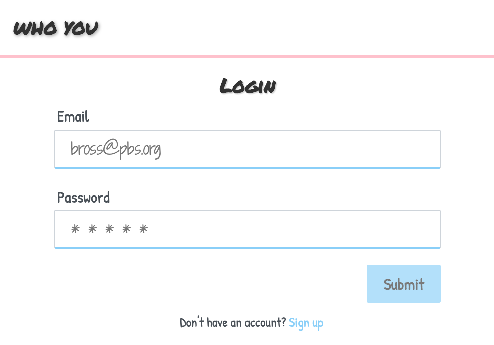
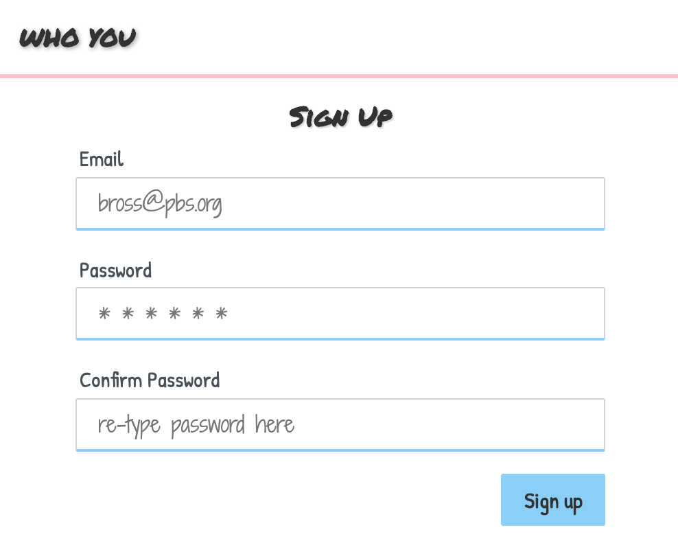
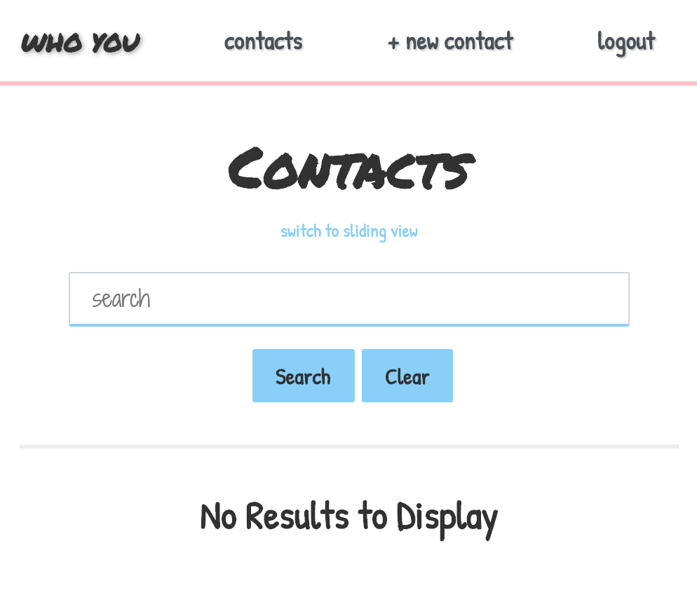
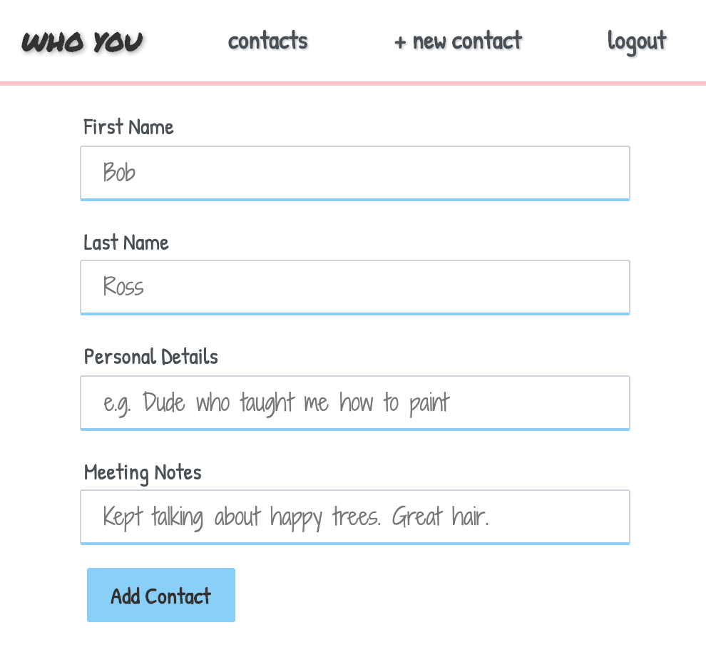

# WHO YOU
Who You is alternative take on the conventional contacts app, designed specifically for the period betwen just after meeting someoone but before connecting with them in another channel--like social media, phone, etc.

## How to Use
This application is intentionally simple and lightweight for sake of expediency. It stores a limited amount of information as it serves as a transient solution for identifying information about someone's contact.

### 1. Login / Signup

When a user is unauthenticated, the "/" route redirects to the login page. First-time users can create an account by following the link just below the login form.

To sign up, users must provide an email and a password, the latter of which is doublechecked in the "confirm password" field.

After signing up, users are immediately prompted to login.

### 2. Contacts / Create New Contact

When a user is authenticated, the "/" route redirects to the contacts page. A new user's page will have no contacts. Users can begin creating new contacts with the "+ new contact" link in the navbar.

Contact records have only four fields:
* Quick Reference: The only required field, intended for unique identifying information (e.g. "girl with the dragon tattoo" or "man with the golden gun")
* First Name: Self-explanatory
* Last Name: Self-explanatory
* Meeting Notes: Intended for the context of the encounter (e.g. "conference" or "house party")

### 3. Delete Contact
If a user no longer needs to store a contact on Who You, they can easily delete the record by clicking the small pink "x" at the top right of a contact card. This action is immediate and irreversible.

### 4. Toggle Views
By clicking the link just below the "Contacts" heading, users can switch between two different ways of viewing their contacts: scrolling vertically (default) and sliding horizontally (alternate).

### 5. Navigation
A simple navbar allows facile movement between the different fucntions of the app. The "WHO YOU" link always drives to the "/" route and is the only navbar element visible in every view of the app.

## Data Structure
Data is stored using MongoDB. The application requires only two simple collections:

1. User: to store emails and passwords for each account
2. Contact: to store each user's many contacts

Excluding IDs, the application only actively uses seven data fields--three in the User collection and four in the Contact collection. The latter's model includes some unused data fields that may be implemented later to provide greater detail to each individual contact.

## Technologies
This is a web-based application built using React.js. Other dependencies include:

* axios
* bcrypt
* cookie-parser
* cookie-session
* eslint
* express
* express-session
* if-env
* js-cookie
* mongoose
* morgan
* react-spring
* session

## Random Notes
The minimalist style is based off a simple index card, where contact information was often scribbled before the digital age.